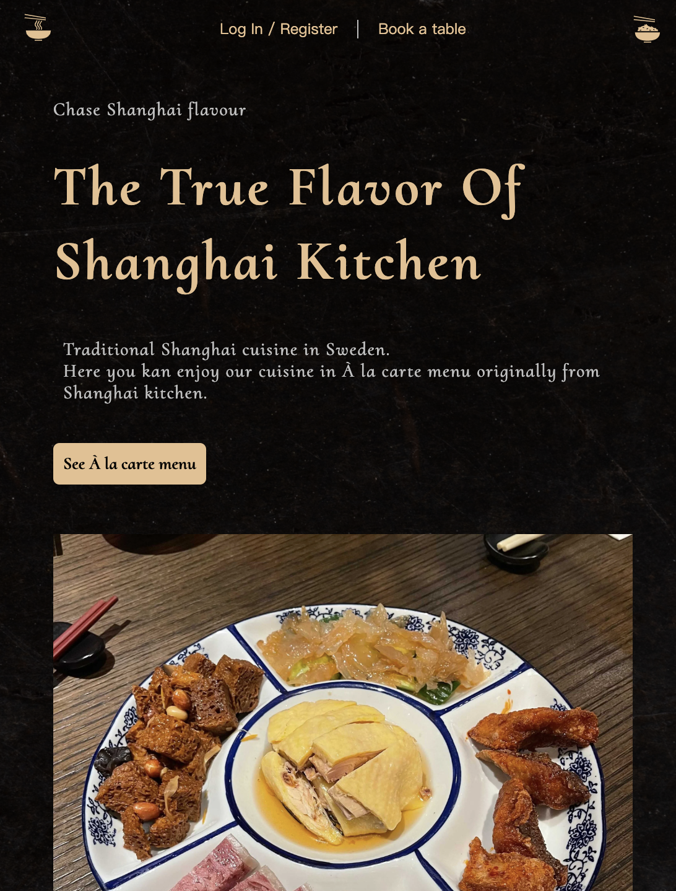
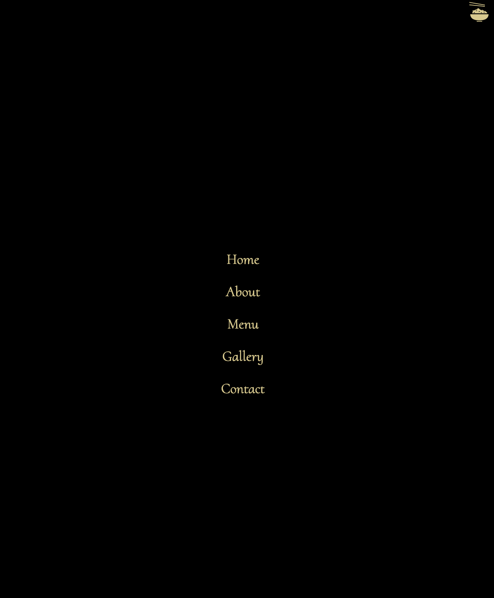

# Demo 👉 [Shanghai Kitchen](https://shanghai-kitchen.netlify.app)

A modern UI and UX restaurant menu page website avaialable for both laptop and mobile devices. 

## Tech stack 
- ***[Figma design](https://www.figma.com/file/qIeq8wljpCaJMLX3XybvDz/Shanghai-kitchen?node-id=0%3A1&t=bTJGZ5iUC4yx9Bcr-0)***
- ***React.js***: A JavaScript library for building user interfaces
- ***React-icons***: A library that helps you add icons (from all different icon libraries) to react apps
- ***[CSS and CSS BEM Model](https://getbem.com/introduction/)***: Block Element Modifier methodology 

## Setup
Run `npm install react react-icons && npm start`

## Screenshots
### Laptop 

### Mobile devices

